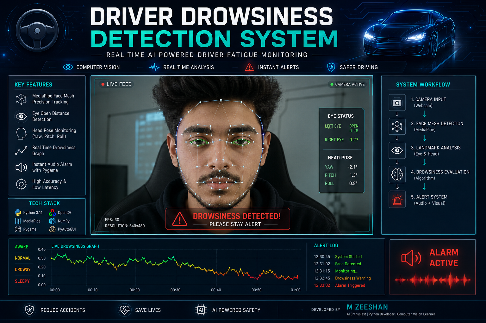

<p align="center">
  
</p>

# 🚗 Driver Drowsiness Detection System

<p align="center">
  <b>Real Time AI Powered Driver Fatigue Monitoring using Computer Vision</b><br>
  Detects eye closure, head movement, and signs of drowsiness to help reduce accident risks.
</p>

<p align="center">


</p>

---

# 📖 Overview

Driver fatigue is one of the leading causes of road accidents worldwide. This project leverages modern Computer Vision techniques to continuously monitor a driver's facial behavior in real time.

Using **MediaPipe Face Mesh**, the system accurately tracks facial landmarks, measures eye openness, analyzes head orientation, and generates instant alerts whenever signs of drowsiness are detected.

Unlike traditional Haar Cascade approaches, this implementation provides much greater precision and stability by utilizing a full facial mesh model.

---

# ✨ Features

### 👁️ Intelligent Eye Tracking

Detects eye closure by calculating the distance between upper and lower eyelids using facial landmarks.

### 🧠 AI Based Fatigue Detection

Analyzes multiple facial indicators instead of relying on simple blink detection.

### 📊 Live Drowsiness Graph

Displays a real time moving graph of eye activity, allowing visual monitoring of fatigue patterns.

### 🔊 Instant Audio Warning

Triggers an immediate alarm using Pygame whenever the driver appears drowsy.

### 🎯 High Precision Face Mesh

Powered by MediaPipe's advanced 3D facial landmark model for reliable detection.

### ⚡ Real Time Processing

Optimized for smooth webcam performance with minimal latency.

### 🖥️ System Integration

Includes support for future automation using Python modules such as:

* pyautogui
* webbrowser

---

# 🏗️ System Workflow

```text
                 Webcam Feed
                      │
                      ▼
             OpenCV Frame Capture
                      │
                      ▼
          MediaPipe Face Mesh
                      │
         ┌────────────┴────────────┐
         │                         │
         ▼                         ▼
 Eye Distance Analysis      Head Angle Analysis
         │                         │
         └────────────┬────────────┘
                      ▼
           Drowsiness Evaluation
                      │
         ┌────────────┴────────────┐
         │                         │
         ▼                         ▼
   Live Graph Display       Audio Alarm
                      │
                      ▼
               Driver Alert
```

---

# ⚙️ Technology Stack

| Component                 | Technology            |
| ------------------------- | --------------------- |
| Programming Language      | Python 3.11           |
| Computer Vision           | OpenCV                |
| Facial Landmark Detection | MediaPipe Face Mesh   |
| Numerical Processing      | NumPy                 |
| Audio Alert System        | Pygame                |
| Data Buffering            | collections.deque     |
| Future Automation         | PyAutoGUI, Webbrowser |

---

# 🔬 Detection Pipeline

### 1️⃣ Video Capture

OpenCV continuously captures frames from the webcam.

### 2️⃣ Face Landmark Extraction

MediaPipe detects and maps facial landmarks with high precision.

### 3️⃣ Eye Distance Calculation

The algorithm calculates the distance between eyelid landmarks to determine eye openness.

### 4️⃣ Head Position Monitoring

The system tracks head orientation to identify abnormal movement patterns.

### 5️⃣ Fatigue Analysis

Eye and head data are evaluated against predefined thresholds.

### 6️⃣ Alert Generation

If drowsiness persists beyond the safety limit, an instant audio alarm is activated.

---

# 📂 Project Structure

```text
Driver-Drowsiness-Detection/
│
├── main.py
├── alarm.wav
├── requirements.txt
├── README.md
└── assets/
```

---

# 🚀 Getting Started

## Clone the Repository

```bash
git clone https://github.com/zeeshan-aibuilder/Driver-Drowsiness-Detection.git

cd Driver-Drowsiness-Detection
```

---

## Create Virtual Environment

```bash
python -m venv env

env\Scripts\activate
```

---

## Install Dependencies

```bash
pip install opencv-python

pip install mediapipe

pip install numpy

pip install pygame

pip install pyautogui
```

Or simply:

```bash
pip install -r requirements.txt
```

---

## Run the Project

```bash
python main.py
```

Allow webcam access when prompted.

---

# 🎯 Future Improvements

✅ Eye Aspect Ratio Optimization

✅ Head Pose Estimation

⬜ Multi Face Detection

⬜ Night Vision Support

⬜ SMS or Email Emergency Alerts

⬜ Mobile Application Integration

⬜ Driver Performance Analytics Dashboard

⬜ Deep Learning Based Fatigue Classification

---

# 📸 Demo

You can add screenshots or a GIF here for a better repository presentation.

```markdown

```

---

# 💡 Learning Outcomes

This project demonstrates practical implementation of:

* Computer Vision
* Facial Landmark Detection
* Real Time Video Processing
* Human Computer Interaction
* Audio Event Triggering
* Python Application Development

---

# 👨‍💻 Developer

## M Zeeshan

**Artificial Intelligence Student**

**Python Developer**

**Computer Vision Enthusiast**

---

<p align="center">
Built with ❤️ using Python, OpenCV and MediaPipe
</p>
